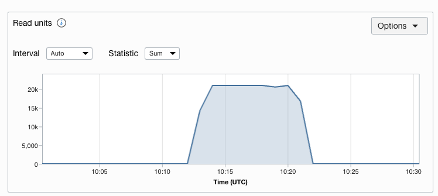
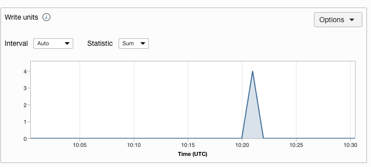

# How to optimize the cost of the oracle nosql cloud tables?

NoSQL is used to store JSON document, columnar and key-value database models, delivering predictable single digit millisecond response times with data replication for high availability.

Let us look at a use case with estimated cost and further steps to reduce the cost.

Use Case: A customer would like to track the rate card for list of tenancies that organizaton owns.
    sol: Connect to each tenancy and store it in no-sql table (oci_client_reatecard) in oracle cloud. furhter can be used to process

Sample Cost Calculation:
NoSQL billing cost is calculated based on storage size, reads & writes allocation.
| Table Name | No. of Reads. | No. of writes | Database size | Cost |
| ---------- | ------------- | ------------- | --------------- | ---- |
| oci_client_reatecard | 1000 | 1000 |10gb| ~$132.46 |

This cost may vary, please check Cost Estimator - [link](https://www.oracle.com/in/cloud/costestimator.html) for latest rates

As per the use case this process will take ~10 mins to complete this requirement with daily cron job in OKE.

In 24hrs of a day, compute power is required during the job execution time. It does not require any reads and writes in idle.

By implementing the best practices, the cost can be further reduced.

Manually it is not possible to allocate before the start of process and reduce after the process. Oracle NoSQL SDK supports to set the read and write using the API.

After best practice
| Table Name | No. of Reads. | No. of writes | Database size | Cost |
| ---------- | ------------- | ------------- | --------------- | ---- |
| oci_client_reatecard | 200 | 1 |10gb| ~$2.07 |

Overall cost is reduced by 98%.

Sample Execution

# Read Units

# Write Units

# Flow

start -> Increase read & writes -> Process Job -> Reduce Reads & writes -> Stop

Step 1: Fill the values in config.py [link](https://docs.oracle.com/en-us/iaas/Content/API/Concepts/sdkconfig.htm)

Step 2: Run the main.py

# References

Know about nosql [link](https://www.oracle.com/in/database/nosql/technologies/nosql/)
Try with Local installation of NoSQL [link](https://www.oracle.com/database/technologies/nosql-database-server-downloads.html)
